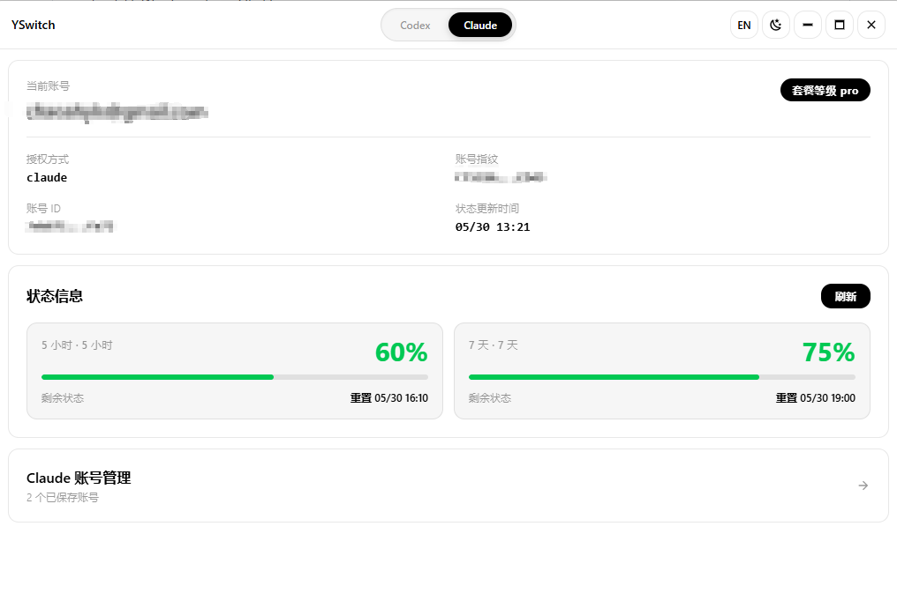
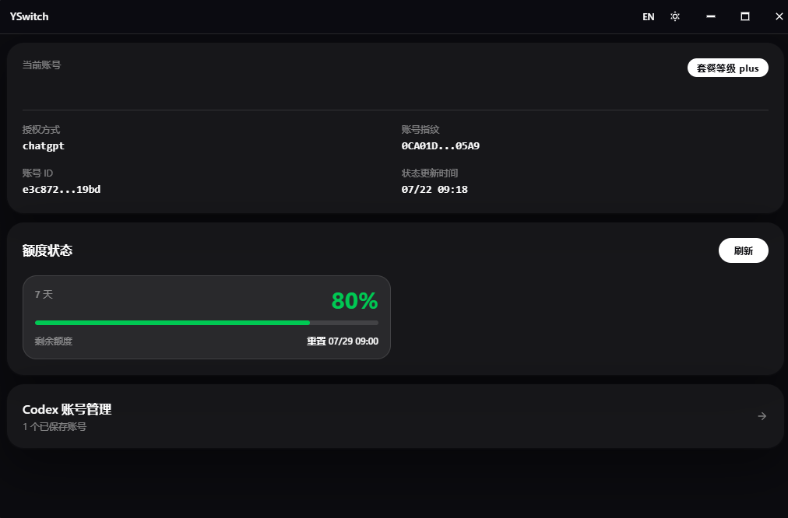

# YSwitch

[中文](README.md) | English

**YSwitch** is an open-source desktop tool for quickly switching between multiple Codex accounts. Built with [Wails](https://wails.io), Go backend + Vue frontend, currently Windows only.

## Screenshots

| Light Mode | Dark Mode |
|-----------|----------|
|  |  |

---

## Features

- **Account Saving**: Save the current logged-in Codex account credentials to a local account library, supporting multiple accounts.
- **One-Click Switching**: Select the target account and click Switch — the tool automatically replaces the local credential files and restarts the corresponding client, no manual steps required.
- **Quota Viewing**: View the plan type and remaining quota for each account (based on locally saved credentials; if a token has expired, switch to that account first before refreshing — see note below).
- **Local Vault**: Saved account files stay on your machine. Quota refresh uses the corresponding official service API only.

---

## About Quota Viewing

YSwitch is **not an official multi-account parallel query tool** — it is fundamentally a local credential switcher:

- After logging in, clicking **Save Current Account** backs up the current `~/.codex/auth.json` to the local account library.
- **Switch** replaces the active credential file with the selected account's backup and restarts Codex so it runs under the new account.
- **Refresh Quota** reads the saved credentials for each account and calls the official API to fetch quota.

**Why can both accounts be queried today, but only the active one tomorrow?**

| Reason | Explanation |
|--------|-------------|
| Short-lived access tokens | Codex credentials contain short-lived tokens. Only the currently active account has its token automatically refreshed by Codex; backed-up credentials are never renewed in the background. |
| Backups are static snapshots | Credentials are fresh when saved. By the next day, the token for the non-active account may have expired, and YSwitch cannot obtain a new token on its behalf. |
| Quota refresh uses saved credentials | Refreshing quota does not switch accounts — it uses the token from the time of saving. Once that token expires, the query will fail. |

**Recommended Usage**

To get the latest quota for a specific account, **switch to that account first**, wait for Codex to reload under the new account, and then click **Refresh Quota**. Do not expect multiple accounts to continuously show up-to-date quota without switching.

---

## Login Method

**This tool does not implement any login logic. All logins are completed through the official clients.**

| Account Type | Login Method |
|-------------|-------------|
| **Codex** | Log in via the official Codex desktop client |

After logging in, YSwitch reads, backs up, and replaces Codex credential files locally. When you refresh quota, it sends the access token only to the official ChatGPT quota endpoint; it does not upload credentials to any third-party server.

---

## Quick Start

### Requirements

- [Go](https://go.dev/) 1.21+
- [Node.js](https://nodejs.org/) 18+
- [Wails CLI](https://wails.io/docs/gettingstarted/installation) v2

### Development Mode

```bash
wails dev
```

### Build Release

```bash
wails build
```

---

## Usage

### Codex Accounts

1. Log in to account A via the official Codex desktop client, then open YSwitch.
2. Click **Save Current Account** to store account A in the library.
3. Exit the Codex client and log in to account B, then return to YSwitch and click **Save Current Account** again.
4. To switch later: select the target account and click **Switch** — the tool will automatically replace the credential file and restart Codex.

---

## ⭐ Support the Project

If YSwitch is helpful to you, consider giving it a Star ⭐!

---

## Disclaimer

- This project is **fully open-source**, intended for learning and personal use only. No commercial services are provided.
- The sole function of this tool is to manage and switch locally stored credential files for already-logged-in accounts. **It does not involve any cracking, bypassing, or policy-violating operations.**
- If your account is banned, restricted, or you suffer any other loss while using this tool, **this project bears no responsibility**. Please review the relevant platform terms of service before deciding whether to use it.
